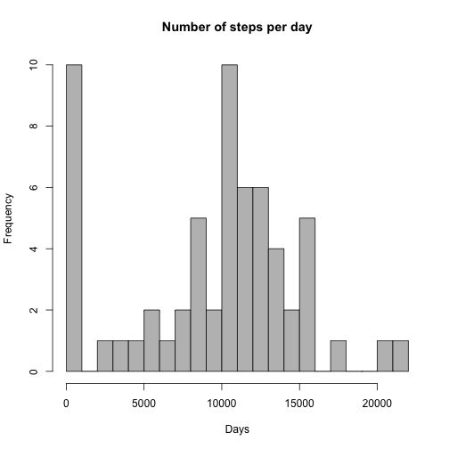
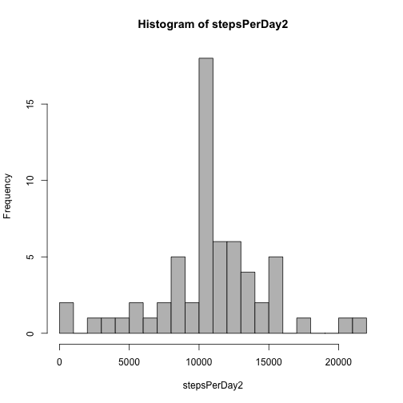

Reproducible Research: Peer Assessment 1
=========================================
The structure of the report corresponds to assignment
## Loading and preprocessing the data

The dataset file "activity.csv" is in the working directory. In this case it is loaded this way:


```r
data <- read.csv("activity.csv")
```

General information about the dataset is obtained as:

```r
str(data)
```

```
## 'data.frame':	17568 obs. of  3 variables:
##  $ steps   : int  NA NA NA NA NA NA NA NA NA NA ...
##  $ date    : Factor w/ 61 levels "2012-10-01","2012-10-02",..: 1 1 1 1 1 1 1 1 1 1 ...
##  $ interval: int  0 5 10 15 20 25 30 35 40 45 ...
```

So the dataset includes 3 variables (steps, date, interval) and 17568 observations.

## Mean total number of steps taken per day
First, I calculate the number of steps per day ignoring missing values:

```r
stepsPerDay <- by(data$steps, data$date, sum, na.rm = TRUE)
```

Then I make a histogram using base graphics:

```r
hist(stepsPerDay, breaks = 20, col = 'grey', xlab = "Days", main = "Number of steps per day")
```

 

Mean and median values calculated as follows:

```r
meanSteps <- mean(stepsPerDay, na.rm = TRUE)
meanSteps
```

```
## [1] 9354.23
```

```r
medianSteps <- median(stepsPerDay, na.rm = TRUE)
medianSteps
```

```
## [1] 10395
```
So the mean is 9354 and the median is 10395.

## Average daily activity pattern
Average number of steps taken per each 5-minute interval:


```r
avgStepsPerInterval <- by(data$steps, data$interval, mean, na.rm = TRUE)
plot(names(avgStepsPerInterval), avgStepsPerInterval, type='l', xlab = "Intervals", ylab = "Average number of steps")
```

 

We can see a peak on the plot. To get the exact identification number of the interval use


```r
maxInt <- names(avgStepsPerInterval)[which.max(avgStepsPerInterval)]
maxInt
```

```
## [1] "835"
```

So the maximum number of steps on average is taken in the interval 835.

## Imputing missing values

The dataset includes missing values in "step" column only (the total number of missing values in other columns is 0). So the total number of missing values in the dataset is

```r
sum(is.na(data$steps))
```

```
## [1] 2304
```

I decided to replace missing values with mean value for corresponding interval. The dataset has a simple structure with 61 dates each of those devided into 288 intervals. So I created new variable `avgSteps` that includes average number of steps per interval for all data:

```r
avgSteps <- rep(avgStepsPerInterval, dim(table(data$date)))
```

The new dataset with replaced missing values is

```r
data2 <- data
data2$steps[is.na(data2$steps)] <- avgSteps[is.na(data2$steps)] 
```

There is no missing values in new dataset.

```r
sum(is.na(data2$steps))
```

```
## [1] 0
```

The number of steps per day in new dataset:

```r
stepsPerDay2 <- by(data2$steps, data2$date, sum)
```

A histogram:

```r
hist(stepsPerDay2, breaks = 20, col = 'grey')
```

 

Mean and median values:

```r
meanSteps2 <- mean(stepsPerDay2)
meanSteps2
```

```
## [1] 10766.19
```

```r
medianSteps2 <- median(stepsPerDay2)
unname(medianSteps2)
```

```
## [1] 10766.19
```
So the mean is 10766 and the median is 10766.

The mean and median values (10766 and 10766) greater than in initial dataset (9354 and 10395). It is explained by the fact that the new one includes smaller number of zero values that correspond to totally missing days in initial dataset.

## Differences in activity patterns between weekdays and weekends

A new factor variable `wDay` with two levels -- "weekday" and "weekend" indicating whether a given date is a weekday or weekend day.


```r
wDay <- format(as.Date(data2$date), "%u") # Weekday as a decimal number (1–7, Monday is 1)
wDay <- factor(wDay>5, labels = c("weekday", "weekend"))
data2$wDay <- wDay
```

A panel plot comparing weekday and weekend average steps per interval


```r
avgStepsPerIntervalWE <- by(data2$steps[data2$wDay=="weekend"], 
                            data2$interval[data2$wDay=="weekend"], mean)
avgStepsPerIntervalWD <- by(data2$steps[data2$wDay=="weekday"], 
                            data2$interval[data2$wDay=="weekday"], mean)

par(mfrow = c(2,1), mar = c(4,2,1.5,1))
plot(names(avgStepsPerIntervalWE),avgStepsPerIntervalWE, type='l', 
     main = "weekend", xaxt = "n", xlab="", ylab="", 
     ylim = c(0, max(avgStepsPerInterval)+25))
plot(names(avgStepsPerIntervalWD),avgStepsPerIntervalWD, type='l', 
     main = "weekday", xlab="Intervals", ylab="", 
     ylim = c(0, max(avgStepsPerInterval)+25))
```

 

The weekend plot does not have such strong peak as weekday. Steps are more "spreaded" during the day.
